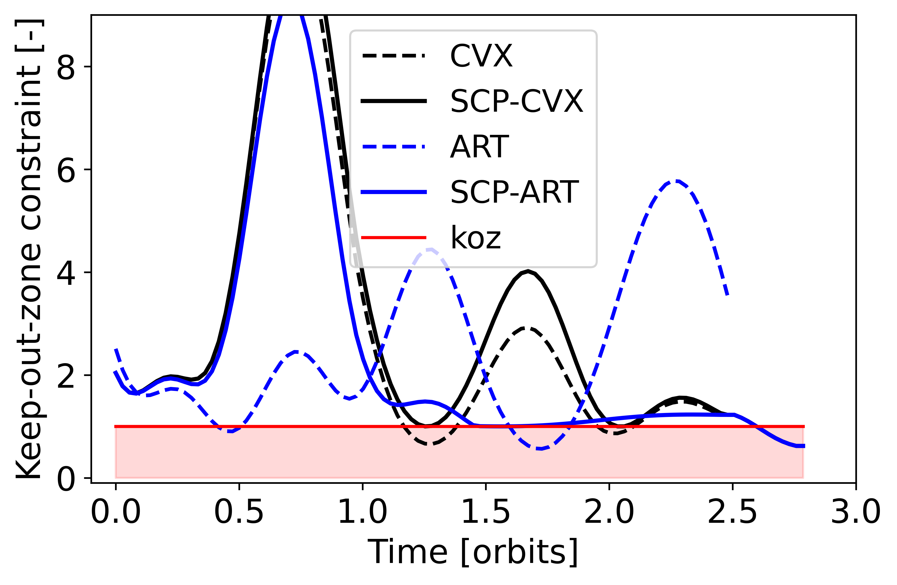

# Radial Autonomous Rendezvous Transformer
*Testing the effectiveness of temporal radial attention within SLAB+ASL's Autonomous Rendevous Transformer (ART) and Sequential Convex Programming (SCP) pipeline.*

---

## 1  What is Radial ART?

ART is a Decision-Transformer that learns offline to map orbital states (rtn or roe), return-to-go (fuel budget), and constraint-to-go (keep-out-zone violation budget) to the next $`\Delta v`$ control actions for proximity-operations and docking. Standard ART uses dense GPT-2 attention. Thus, memory and compute scale quadratically with the N=4·K timestep token context. Applying Radial Attention replaces the dense pattern with a log-polar, block-sparse mask of:

1. dense band of width $`w_0`$ around the diagonal 
2. attention span halves every log-distance group 
        
As a result, this requires only $`\mathcal{O} (N \log N )`$ tokens. This procedure should both speed-up inference and require less VRAM with little to no loss in control performance. To integrate the adjustment, LoRA is used to fine-tune and adapt the sparse model to the original dataset.

In a more physically intuitive sense, radial attention allows the transformer to learn by attributing less attention to far off dynamics (far-future or far-past) while maintaining full focus on the near-time dynamics. Given the local nature of classical dynamics, this approach seems somewhat natural.

---

## 2  Implementation Details

1. Load dense base model weights
2. Swap dense blocks for sparse radial blocks
3. Configure LoRA adapters
4. Fine tune on A100 with accelerate+flash-attn (requires fp16)
5. Evaluate with new model in ART-SCP Pipeline

---

## 3  Persisting Issues/TODO:

1. Update repo
2. Implement planned features
3. Migrate from colab script
4. Investigate switch back to fp32 (flash-attn limited)

---

## 4  Repository Contains:

This repo contains the src folder with the radial_swap function to hot-swap the dense GPT-2 attention blocks and the modified training and evaluation scripts to fine-tune and evaluate the Radial ART model. The repo also contains the full Radial ART pipeline within a rough colab script.

---

## 5  Testing Results:

From initial evaluation, results show some promise, though are not quite ideal.

| Model          |   Cost   |  Runtime |
|----------------|:--------:|:--------:|
|       CVX      |  0.2010  |  0.2083  |
|     CVX+SCP    |  0.2114  |  2.2871  |
|       ART      |  0.2724  |    -     |
|   Radial ART   |  0.1714  |  1.1001  |
|     ART+SCP    |  0.2010  |    -     |
| Radial ART+SCP |  0.2102  |    -     |
|Expected Results| ~0.2010  |  ~0.4000 |

*Note: In the following figures ART and ART-SCP are the evaluated Radial ART and Radial ART-SCP models.

<table>
  <tr>
    <td align="center">
       
      <em>3-D Trajectory With+Without Radial ART+SCP</em>
    </td>
    <td align="center">
       
      <em>ROE vs. Time</em>
    </td>
  </tr>
  <tr>
    <td align="center">
       
      <em>Delta v Profile</em>
    </td>
    <td align="center">
       
      <em>KOZ Constraint</em>
    </td>
  </tr>
</table>

**Positive Results:**
- Memory is indeed reduced with sparse-radial attention masks cutting nearly 70% of attention-matrix memory (and associated large reduction in VRAM). 
- In addition, Radial ART+SCP performs roughly 0.09% worse than ART+SCP, which is reasonable given the reduced memory.

**Negative Results:**
- While Radial ART alone appears to excel, this is the result of violating feasibility/koz and thus cannot be taken in actuality. 
- This conclusion for Radial ART alone is further suggested as the Radial ART+SCP performs slightly worse than ART+SCP (does not take a phantom 0.1714 cost solution). This slight underperformance, is not too surprising, given the use of sparse radial attention. However, the model should be able to reach nearly identical performance. This underperformance could also be because of the use of fp16 weights instead of the standard ART's fp32. This switch to half values was required as flash-attn (required in radial-attention repo and used for fast inferencing) only supports fp16.
 - Most notably, inference is far slower than expected. The cause of the slow-down is not known, though likely lies in some fault within the proper integration of flash-attn.
 
 ---
 
## 6  Conclusion
As a result, it seems radial attention does not perform as well as expected within the ART-SCP pipeline. However, promising results are certainly shown and warrant further investigation, imporvement, and bug finding/fixing within this implementation.

---

## 7  License

This project is licensed under the MIT License – see `LICENSE` for details.

